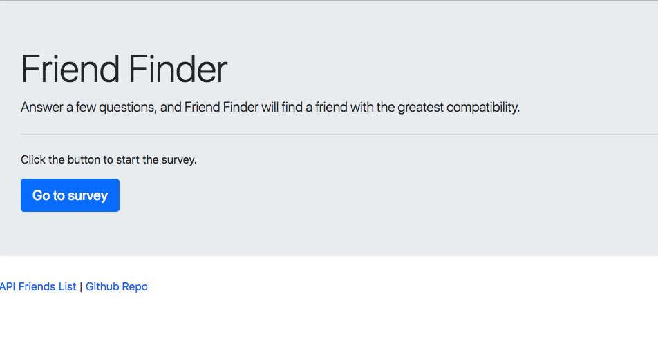
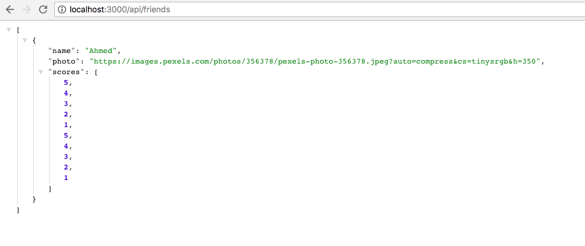
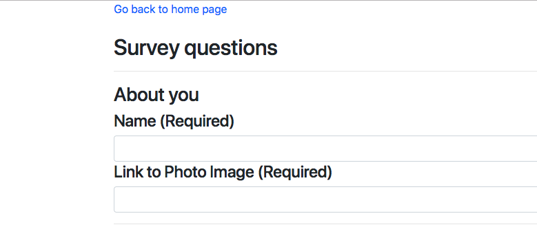
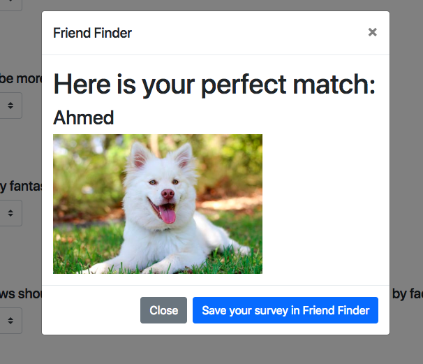

# friendfinder

Heroku App URL: https://friend-finder-myproject.herokuapp.com/

### Overview
This is a school assignment that focuses on the use of express and creating/using APIS. The site searches for a match based on the user's survey results and the user has the choice of submitting their results to Friend Finder for others to find. 

### Instructions

You can use the Heroku URL above to try it out. Or if you have cloned/downloaded it, you must go to the directory in your terminal and type in `npm run watch` or `node server.js` to start a localhost. Type in `localhost:3000` in your browser and you should see the home page:

You can view the list of friends by clicking "API Friends List" on the home page. This will show you the JSON objects of each friend info:

Clicking the "Survey" button will lead you to the survey page. You must input a name and a photo url. If you do not, submitting any information will result in a modal alerting you to add a name and photo:

Once you have inputted all the information, Friend Finder will go through each friend in the API and pick the one that closely resembles the user's survey results. It will display the name and the photo of the match, and the user can click on the "Save your survey to Friend Finder" and the user's info will be added to the list of other friends. 

### Additional Information

Since there is only one sample 'friend' in Friend Finder, you will always be matched with that sample. You can add more samples by going to `/data/friends.js` and add the objects there. 

